# Intersight HyperFlex Cluster Terraform Module

## Introduction
This module will simplify the configuration & deployment of a HyperFlex HCI cluster through the Intersight Cloud Operating Platform.

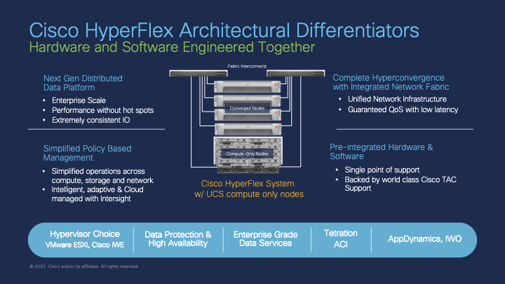

HyperFlex clusters are configured using a set of policies grouped together as a profile.  The profile is then assigned to a group of physical HyperFlex servers, themselves either connected and managed through a pair of Cisco UCS Fabric Interconnects (i.e. **HyperFlex Data Center** clusters) or connected directly any upstream switches (i.e. **HyperFlex Edge** clusters).  This module will support either connectivity model.

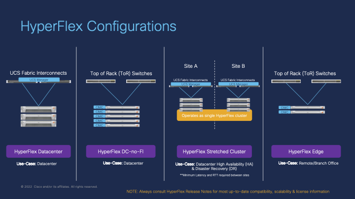

This module will suport deploying HyperFlex clusters with either the default *VMware vSphere ESXi* operating system, or now the *[Cisco Intersight Workload Engine (IWE)](https://www.cisco.com/c/en/us/products/collateral/cloud-systems-management/intersight/at-a-glance-c45-2470301.html)* operating system for Kubernetes-based workloads. There are some configuration differences between these two operating systems.  Please see the section for each OS below.

## Module Usage
### Deployment
**NOTE:** Currently the Intersight API does not currently support both configuring & deploying the HyperFlex cluster from Terraform in one single plan.  Instead the plan has to be run twice.

For details on deploying an HX cluster with VMware ESXi please see the section [VMware vSphere ESXi Operating System](#vmware-vsphere-esxi-operating-system).

For details on deploying an HX cluster with Cisco IWE please see the the section [Cisco Intersight Workload Engine Operating System](#cisco-intersight-workload-engine-operating-system).

#### Step 1: Define the cluster configuration and assign server nodes
Run the Terraform plan with `action = "No-op"`.

This step will create the necessary cluster profile and associated policies in Intersight as well as assign servers to the profile.  Assigning servers will automaticaly create Interisght node profiles which must be present before the cluster can be deployed in Step 2.

#### Step 2: Deploy the HyperFlex cluster
Run the Terraform plan again with `action = "Deploy"`.

This step will run the Validate & Deploy task within Intersight and begin the process of deploying the HyperFlex cluster.  This step can be monitored within the Intersight GUI at either the HyperFlex profiles page or in more detail under the Intersight Requests page.

### Undeployment
To undeploy the cluster from Terrafom **DO NOT** run a destroy plan without first unassigning the servers from the cluster as this can leave the profile in a `DeleteFailed` state and will need to be manually deleted through the Intersight API.

There is no "Undeploy" task for HyperFlex clusters in Intersight.  The expectation is that if the cluster is no longer required, it will be shutdown and server (service) profiles unassociated from the servers.  The servers can then be re-imaged and/or factory defaulted and re-used for other purposes.

Our recommended procedure is:
##### 1. Shutdown servers and remove server profile association #####
This would be through vCenter, Intersight or UCS Manager.  This also marks the servers as available for use by other/new server profiles.  By default the server policies used for HyperFlex profiles **DOES NOT** wipe or format the servers' drives.  This would need to be manually done or the policy updated to force securely wiping & re-formatting the drives on server profile disassocation.

##### 2. Unassign the servers from the cluster #####
Run the Terraform plan again with `action = "Unassign"`.

This will remove the automatically created node profiles within Intersight.  This profile can effectively be re-used and re-assigned to different server nodes at this stage.   

##### 3. Delete the HyperFlex profile & policies #####
Run the Terraform plan as a **DESTROY** type plan.  

This will trigger Intersight to delete the HyperFlex profile and any policies that were also created as part of the original plan.   Re-used policies will not be affected.  Terraform will remove all resources & data sources from the state file at this stage.

##### 4. Unclaim HyperFlex and IWE targets #####
As there is no undeploy action within Intersight, it has no way of knowing the cluster is no longer present.  Depending on the cluster, there may be targets for
* The HyperFlex cluster itself (i.e the HXDP controller)
* The IWE OS & Kubernetes cluster (if IWE type cluster)
* Each individual HX server node (if standalone or edge deployments)

These may need to be removed manually if applicable or appropriate.

##### 5. Tidy-up IWE Kubernetes Cluster Profile via Intersight API #####
If for some reason, the HyperFlex cluster profile did not delete cleanly the associated bare-metal IKS cluster profile may be hidden from the GUI and left in a `DeleteFailed` state.  This may not be noticeable until attemping to create another cluster with the same name.   To ensure that no profiles are left behind it is good practice to use the Intersight API `GET /api/v1/kubernetes/ClusterProfiles` to ensure no profiles are left in a `status = "DeleteFailed"` state.   Should a profile be found, these can be deleted correctly using the `DELETE /api/v1/kubernetes/ClusterProfiles` API and the MOID of the specific failed profile.

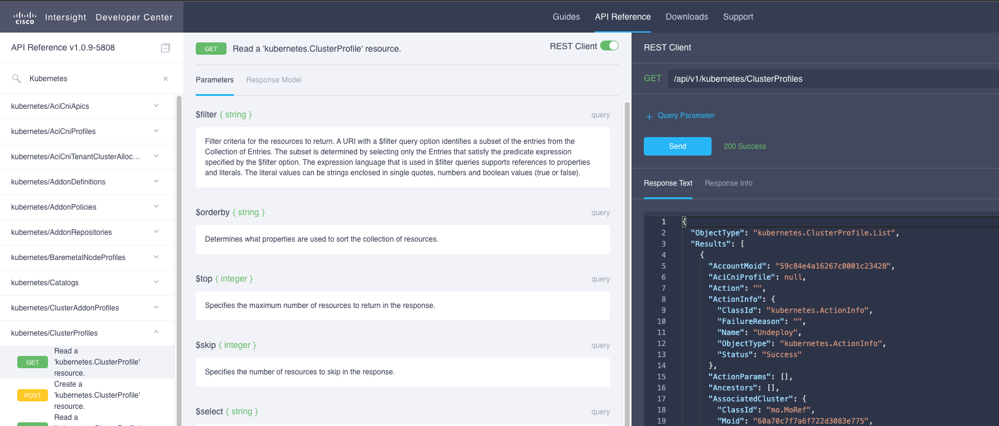

### Common Assumptions
* Intersight credentials have been configured as either a local tfvars file excluded from the Git repository or as a sensitive variable in the Terraform workspace (Cloud / Enterprise verions).  These credentials should never be included in any Git code repositories.
* The passwords to use for HXDP and Hypervisor Admin (root) accounts should also be defined in either a local tfvars file excluded from the Git repository or as a sensitive variable in the Terraform workspace (Cloud / Enterprise verions).  These credentials should never be included in any Git code repositories.
* The `nodes` variable assumes the target HX servers' serial number will be used as the key for the map variable.  `cluster_index` is used to order the cluster and create a hostname suffix. For consistency, these should be assigned the same order as the servers have been discovered by UCS Manager (if used).
* For HyperFlex cluster deployments using UCS Manager-based Fabric Interconnects, the defined `server_firmware_version` firmware package must already be downloaded and available within UCS Manager.

### Caveats
* To destroy the cluster, you must first run the plan with the `action` parameter set to `Unassign`.  Then you will be able to run a destroy plan succesfully.

* The Intersight Terraform provider tracks the `action` parameter as a stateful configuration parameter however Interisght will change this parameter to `No-op` after the action has been submitted.  This will mean any subsequent runs will show the `action` parameter as not matching the state and Terraform will attempt to redeploy the cluster.  This should have no impact however as Intersight will verify nothing has changed.  To avoid this as being seen as a state change in Terraform, set the `action` parameter to `No-op` after the cluster has been deployed and re-run the plan to update the status or run a "refresh" type plan.

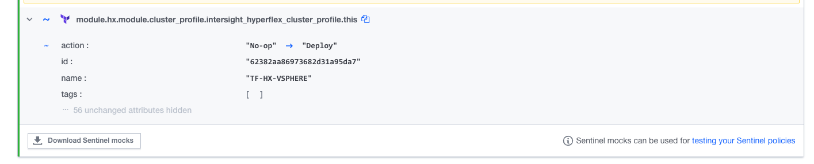

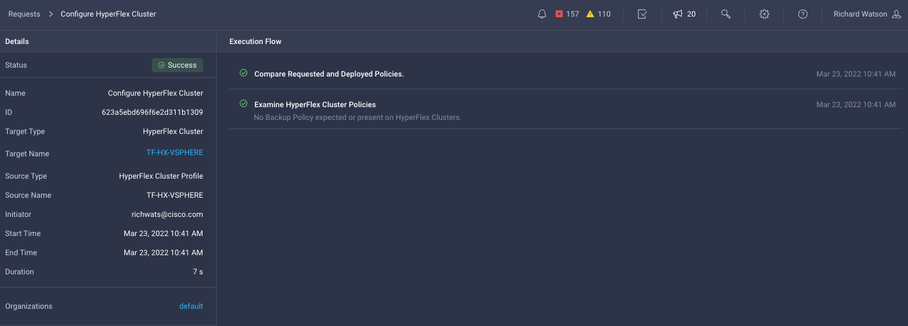

* `wait_for_completion = true` and `action = deploy` will cause Terraform to wait until the deployment has completed.  For HX deployments, this may take longer than the default timeout of 2 hours so this combination is not recommended.  

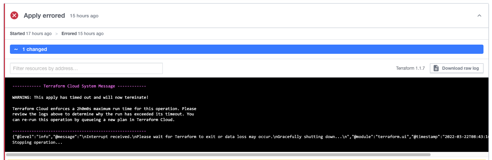

### VMware vSphere ESXi Operating System
#### Assumptions
* If required, a vCenter instance should be available for the HX cluster to be registered to.  This is defined in an optional associated vCenter configuration policy.  If creating a new policy with Terraform, the password for the vCenter account should not be included in the code directly and instead be configured in either a local tfvars file excluded from the Git repository or as a sensitive variable in the Terraform workspace (Cloud / Enterprise versions).

#### Usage
The following is an example plan that uses this module to define and create a new VMware vSphere ESXi-based HyperFlex DC cluster assigned to 3 servers (nodes).  Please see the `/examples/vsphere/dc` directory for more details.

*NOTE:* Some associated policies have been defined inline and some have been re-used (`use_existing = true`)

```hcl
terraform {
  # NOTE: Remove the 'backend' section for locally run Terraform plans with no remote state management.  This is not recommended.
  backend "remote" {
    hostname = "app.terraform.io"
    organization = "mel-ciscolabs-com"
    workspaces {
      name = "iwe-hyperflex"
    }
  }
  required_providers {
    intersight = {
      source = "CiscoDevNet/intersight"
      # version = "1.0.12"
    }
  }
}

### COMMON PROVIDERS ###
provider "intersight" {
  # Configuration options
  apikey    = var.intersight_key
  secretkey = var.intersight_secret
  endpoint =  var.intersight_url
}

### HYPERFLEX CLUSTER PROVISIONING MODULE ###
module "hx" {
  source = "./modules/terraform-intersight-hx"

  ### COMMON SETTINGS ###
  action              = "Deploy" # Validate, Deploy, Continue, Retry, Abort, Unassign, No-op
  wait_for_completion = false
  organization        = "default"
  tags                = []

  ### HYPERFLEX CLUSTER SETTINGS ###
  cluster = {
    name                          = "TF-HX-VSPHERE"
    description                   = "HX Cluster deployed by Terrafrom"
    hypervisor_control_ip_address = "172.31.255.2"
    hypervisor_type               = "ESXi" # ESXi, IWE
    mac_address_prefix            = "00:25:B5:00"
    mgmt_ip_address               = "10.67.53.226"
    mgmt_platform                 = "FI" # FI, EDGE
    replication                   = 3
    host_name_prefix              = "tf-hx-svr" # Must be lowercase

    storage_data_vlan = {
      name    = "HX-STR-DATA-103"
      vlan_id = 103
      }

    }

  ### ASSIGNED NODES (SERVERS) ###
  nodes = {
    WZP23470VYT = {
      cluster_index = 1
    }
    WZP23470VYJ = {
      cluster_index = 2
    }
    WZP23470VYE = {
      cluster_index = 3
    }
  }

  ### ASSOCIATED POLICIES ###

  local_cred_policy = {
    ## NOTE: Passwords have been defined as TFCB workspace variables. No passwords stored here.
    use_existing  = false
    name          = "tf-hx-vsphere-security-policy"
    hxdp_root_pwd               = var.hxdp_root_pwd
    hypervisor_admin            = "root"
    hypervisor_admin_pwd        = var.hypervisor_admin_pwd
    factory_hypervisor_password = true
  }

  sys_config_policy = {
    use_existing  = true
    name          = "mel-dc4-hx1-sys-config-policy"
  }

  vcenter_config_policy = {
    use_existing  = true
    name          = "mel-dc4-hx1-vcenter-config-policy"
  }

  auto_support_policy = {
    use_existing  = true
    name          = "mel-dc4-hx1-auto-support-policy"
  }

  node_config_policy = {
    use_existing      = false
    name              = "tf-hx-vsphere-cluster-node-config-policy"
    description       = "HX vSphere ESXi Cluster Network Policy built from Terraform"
    ### HYPERVISOR MANAGMENT IPs ###
    mgmt_ip_range = {
      start_addr  = "10.67.53.227"
      end_addr    = "10.67.53.230"
      gateway     = "10.67.53.225"
      netmask     = "255.255.255.224"
    }
    ### HYPERFLEX STORAGE CONTROLLER MANAGMENT IPs ###
    hxdp_ip_range = {
      start_addr  = "10.67.53.231"
      end_addr    = "10.67.53.234"
      gateway     = "10.67.53.225"
      netmask     = "255.255.255.224"
      }
  }

  cluster_network_policy = {
    use_existing        = false
    name                = "tf-hx-vsphere-cluster-network-policy"
    description         = "HX vSphere ESXi Cluster Network Policy built from Terraform"
    jumbo_frame         = true
    uplink_speed        = "default"
    kvm_ip_range        = {
      start_addr  = "10.67.29.115"
      end_addr    = "10.67.29.118"
      netmask     = "255.255.255.0"
      gateway     = "10.67.29.1"
    }
    mgmt_vlan           = {
      name    = "HX-MGMT-107"
      vlan_id = 107
    }
    vm_migration_vlan   = {
      name    = "HX-VMOTION-102"
      vlan_id = 102
    }
    vm_network_vlans    = [
      ### NOTE: Cluster Network Policy requires at least one VM Network to be defined ###
      {
        name    = "HX-VM-NET-106"
        vlan_id = 106
      }
    ]
  }

  software_version_policy = {
    use_existing            = false
    name                    = "tf-vsphere-sw-version"
    description             = "HX vSphere ESXi cluster software version policy created by Terraform"
    server_firmware_version = "4.2(1i)"
    hxdp_version            = "4.5(2b)"
  }

}
```

#### Results

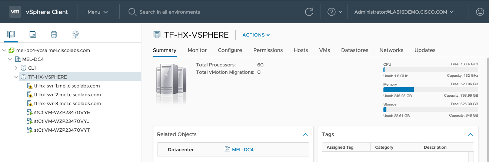

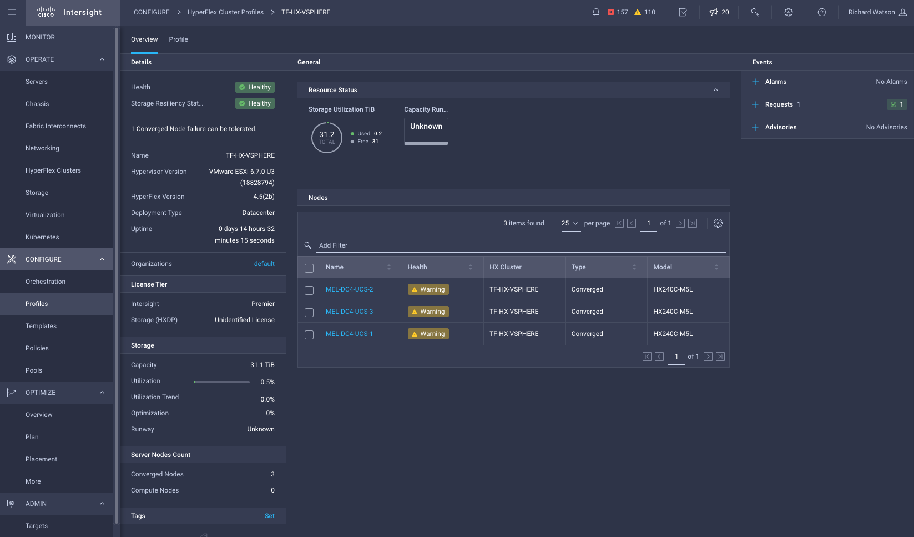

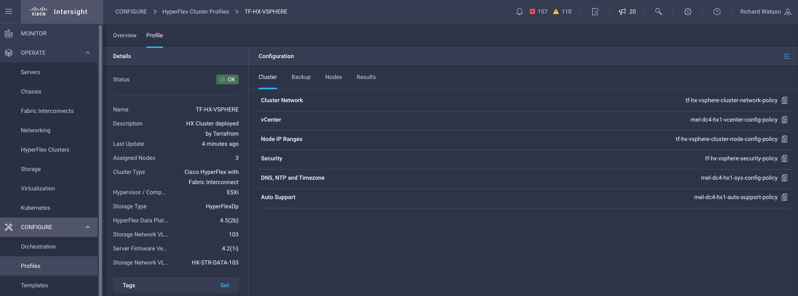

### Cisco Intersight Workload Engine Operating System
#### Caveats
* For IWE deployments, adding VM network VLANs requires the cluster to have been deployed first then the plan run and applied a 2nd time with the variable `cluster_deployed` set to `true`. Also the `action` parameter is not applicable to adding (or removing) additional VLANs.  

#### Usage
The following is an example plan that uses this module to define and create a new Cisco Intersight Workload Engine (IWE) HyperFlex DC cluster assigned to 3 servers (nodes).  Please see the `/examples/iwe/dc` directory for more details.

*NOTE:* Some associated policies have been defined inline and some have been re-used (`use_existing = true`)

```hcl
terraform {
  # NOTE: Remove the 'backend' section for locally run Terraform plans with no remote state management.  This is not recommended.
  backend "remote" {
    hostname = "app.terraform.io"
    organization = "mel-ciscolabs-com"
    workspaces {
      name = "iwe-hyperflex"
    }
  }
  required_providers {
    intersight = {
      source = "CiscoDevNet/intersight"
      # version = "1.0.12"
    }
  }
}

### COMMON PROVIDERS ###
provider "intersight" {
  # Configuration options
  apikey    = var.intersight_key
  secretkey = var.intersight_secret
  endpoint =  var.intersight_url
}

### HYPERFLEX CLUSTER PROVISIONING MODULE ###
module "hx" {
  source = "./modules/terraform-intersight-hx"

  ### COMMON SETTINGS ###
  action              = "Deploy" # Validate, Deploy, Continue, Retry, Abort, Unassign, No-op
  wait_for_completion = false
  organization        = "default"
  tags                = []

  ### HYPERFLEX CLUSTER SETTINGS ###
  cluster = {
    name                          = "TF-HX-IWE"
    description                   = "HX Cluster deployed by Terrafrom"
    hypervisor_control_ip_address = "172.31.255.2"
    hypervisor_type               = "IWE" # ESXi, IWE
    mac_address_prefix            = "00:25:B5:00"
    mgmt_ip_address               = "10.67.53.226"
    mgmt_platform                 = "FI" # FI, EDGE
    replication                   = 3
    host_name_prefix              = "tf-hx-svr" # Must be lowercase

    storage_data_vlan = {
      name    = "HX-STR-DATA-103"
      vlan_id = 103
      }

    ### IWE HYPERVISOR ONLY CLUSTER SETTINGS ###
    storage_client_vlan = {
      name        = "HX-STR-CLIENT-104"
      vlan_id     = 104
      }
    cluster_internal_subnet = {
      gateway                     = "192.168.0.1"
      ip_address                  = "192.168.0.0"
      netmask                     = "255.255.0.0"
      }

    }

  ### ASSIGNED NODES (SERVERS) ###
  nodes = {
    WZP23470VYT = {
      cluster_index = 1
    }
    WZP23470VYJ = {
      cluster_index = 2
    }
    WZP23470VYE = {
      cluster_index = 3
    }
  }

  ### ASSOCIATED POLICIES ###

  local_cred_policy = {
    ## NOTE: Passwords have been defined as TFCB workspace variables. No passwords stored here.
    use_existing  = false
    name          = "tf-hx-iwe-security-policy"
    hxdp_root_pwd               = var.hxdp_root_pwd
    hypervisor_admin            = "iweadmin"
    hypervisor_admin_pwd        = var.hypervisor_admin_pwd
    factory_hypervisor_password = true
  }

  sys_config_policy = {
    use_existing  = true
    name          = "mel-dc4-hx1-sys-config-policy"
  }

  auto_support_policy = {
    use_existing  = true
    name          = "mel-dc4-hx1-auto-support-policy"
  }

  node_config_policy = {
    use_existing      = false
    name              = "tf-hx-iwe-cluster-node-config-policy"
    description       = "HX IWE Cluster Network Policy built from Terraform"
    ### HYPERVISOR MANAGMENT IPs ###
    mgmt_ip_range = {
      start_addr  = "10.67.53.227"
      end_addr    = "10.67.53.230"
      gateway     = "10.67.53.225"
      netmask     = "255.255.255.224"
    }
    ### HYPERFLEX STORAGE CONTROLLER MANAGMENT IPs ###
    hxdp_ip_range = {
      start_addr  = "10.67.53.231"
      end_addr    = "10.67.53.234"
      gateway     = "10.67.53.225"
      netmask     = "255.255.255.224"
      }
    ### (IWE ONLY) HYPERVISOR CLUSTER CONTROL NETWORK IPs ###
    hypervisor_control_ip_range = {
      start_addr  = "172.31.255.10"
      end_addr    = "172.31.255.255"
      gateway     = "172.31.255.1"
      netmask     = "255.255.255.0"
      }
  }

  cluster_network_policy = {
    use_existing        = false
    name                = "tf-hx-iwe-cluster-network-policy"
    description         = "HX IWE Cluster Network Policy built from Terraform"
    jumbo_frame         = true
    uplink_speed        = "default"
    kvm_ip_range        = {
      start_addr  = "10.67.29.115"
      end_addr    = "10.67.29.118"
      netmask     = "255.255.255.0"
      gateway     = "10.67.29.1"
    }
    mgmt_vlan           = {
      name    = "HX-MGMT-107"
      vlan_id = 107
    }
    vm_migration_vlan   = {
      name    = "HX-HYPER-NET-105"
      vlan_id = 105
    }
    vm_network_vlans    = [
      # NOTE:
      # - Cluster Network Policy requires at least one VM Network to be defined as part of the initial cluster configuration.
      # - This policy is locked after deployment so additonal VLANs cannot be added here. For additional (i.e. Day 2) VLAN changes see the "additional_vm_network_vlans" variable below.
      # - The VLAN name will be converted to lower case if not below.
      {
        name    = "HX-VM-NET-106"
        vlan_id = 106
      }
    ]
  }

  software_version_policy = {
    use_existing            = false
    name                    = "tf-iwe-sw-version"
    description             = "HX IWE cluster software version policy created by Terraform"
    server_firmware_version = "4.2(1i)"
    hypervisor_version      = "1.2(1a)"
    hxdp_version            = "4.5(2b)"
  }

  ### ADDITIONAL (DAY 2) VM NETWORK VLANS ###
  # NOTE:
  # - The name will be converted to lower case if not below.
  additional_vm_network_vlans = [
    {
      name    = "test-108"
      vlan_id = 108
      description = "Additional VLAN created by Terraform post Deployment"
    }
  ]
}
```

#### Results


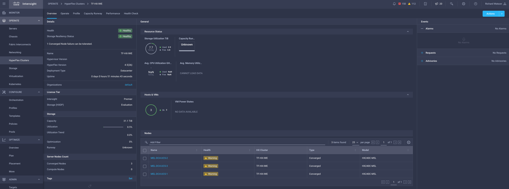

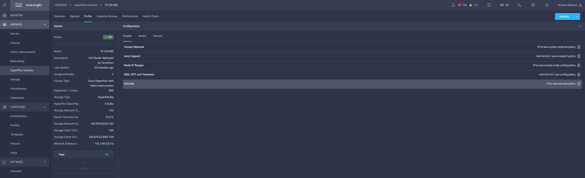

### Advanced Usage
#### Node (Server) Configuration
By default, Intersight will automatically allocate IP addresses for each node from the range of IP addresses defined in the Cluster Node Configuration Policy.  These can be overriden and defined explicitly for each node.

```hcl
### ASSIGNED NODES (SERVERS) ###
nodes = {
  WZP23470VYT = {
    cluster_index           = 1
    hostname                = "server1"
    hxdp_data_ip            = "10.1.1.101" # Usually Auto-Assigned from 169.254.0.0/24
    hxdp_mgmt_ip            = "10.1.2.101"
    hxdp_storage_client_ip  = "10.1.3.101" # IWE Only - Usually Auto-Assigned from 169.254.240.0/24
    hypervisor_control_ip   = "10.1.4.201" # IWE Only
    hypervisor_data_ip      = "10.1.1.201" # Usually Auto-Assigned from 169.254.0.0/24
    hypervisor_mgmt_ip      = "10.1.2.201"

  }
  WZP23470VYJ = {
    cluster_index = 2
    hostname                = "server2"
    hxdp_data_ip            = "10.1.1.102" # Usually Auto-Assigned from 169.254.0.0/24
    hxdp_mgmt_ip            = "10.1.2.102"
    hxdp_storage_client_ip  = "10.1.3.102" # IWE Only - Usually Auto-Assigned from 169.254.240.0/24
    hypervisor_control_ip   = "10.1.4.202" # IWE Only
    hypervisor_data_ip      = "10.1.1.202" # Usually Auto-Assigned from 169.254.0.0/24
    hypervisor_mgmt_ip      = "10.1.2.202"
  }
  WZP23470VYE = {
    cluster_index = 3
    hostname                = "server3"
    hxdp_data_ip            = "10.1.1.103" # Usually Auto-Assigned from 169.254.0.0/24
    hxdp_mgmt_ip            = "10.1.2.103"
    hxdp_storage_client_ip  = "10.1.3.103" # IWE Only - Usually Auto-Assigned from 169.254.240.0/24
    hypervisor_control_ip   = "10.1.4.203" # IWE Only
    hypervisor_data_ip      = "10.1.1.203" # Usually Auto-Assigned from 169.254.0.0/24
    hypervisor_mgmt_ip      = "10.1.2.203"
  }
}
```
